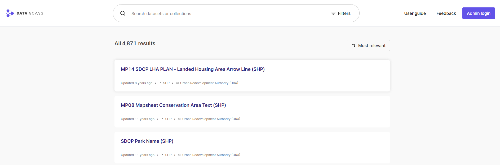

# About
This repository contains notebook codes for scraping the latest available public data metadata as follows using Selenium library:
|Data source|Description|Sample image|
|---|---|---|
|[Data.gov.sg](https://beta.data.gov.sg/datasets)|Data shared by Singapore Government.||
|[Singstats Table Builder](https://tablebuilder.singstat.gov.sg/)| Singapore economic and socio-demographic statistics.||
|[SmartLocal](https://thesmartlocal.com/event-calendar/?a=alltime)| Website for Singapore lifestyle/leisure events.||
|[timeanddate](https://www.timeanddate.com/holidays/?allcountries)| Website for various countries/region holidays covering the period from 2000-2040.||
|[SACEOS](https://saceos.org.sg/)| Singapore Association of Convention & Exhibition Organisers & Suppliers trade association for Meetings, Incentives, Conventions, Exhibitions & Events industry website.||
|[Eventbrite](https://www.eventbrite.sg/d/singapore--singapore/all-events/?page=1)|An American event management and ticketing website with a localised platform in Singapore. The service allows users to browse, create, and promote local events.||

## Installation of libraries (Python)
You may install using package manager such as Python pip or environment management system such as Conda to install all the libraries listed in *requirements.txt*

## Execution and output files
To conduct scraping of metadata from the above sources please execute the cells in the notebook with the *.ipynb* extension. The metadata would be saved as a csv file and stored in the same directory as the corresponding notebooks used for metadata scraping and are named in the following format: *data source_ddmmyyyy_hhmmss.csv* (e.g SACEOS_dataset_16042024_000325.csv). Do note that Data.gov.sg and Singstats data are residing in a common folder, instead of separate folder.

## Disclaimer
Please note that the extracted public data metadata would not perfectly capture all information at 100% rate as published from the sources identified due to varied html construct for events in the page, specifically the case where attempts have been made to pull date/location info of events that are not directly available from the main page of the sources as stated above. However, approximately 90-95% of the data should be captured correctly based on rough eyeball estimates which would suffice for those who want to use it as an input for their model prediction work involving occurrence of public events in Singapore specifically.